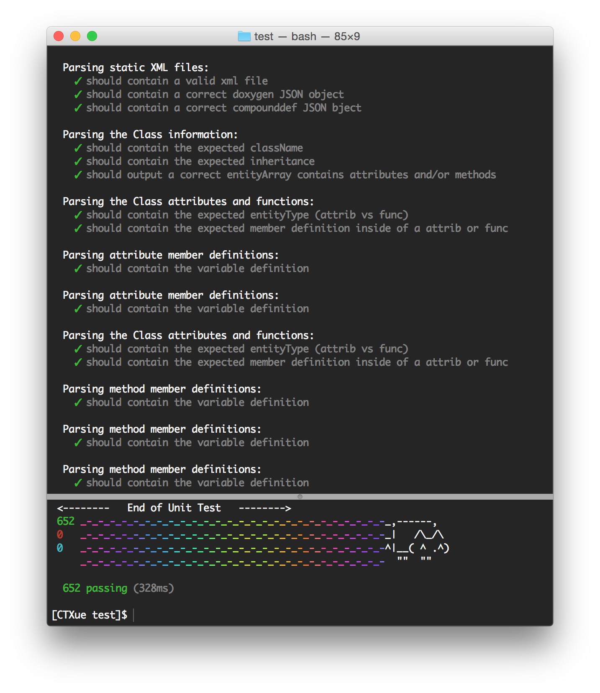

Unit Test for Static Paser
=======
This unit test is behavior driven (known as BDD), which will test all the functionalities, interfaces and outputs match the expected behaviors. It ensures that the output JSON file's correctness to each codebase.
This unit test uses two test libraries (modules): [Mocha](http://mochajs.org) and [Chai](http://chaijs.com)

In order to run this unit test, all the nodejs dependencies has to be installed through npm:
- var fs = require('fs');
- var assert = require("assert");
- var expect = require('chai').expect;
- var parseString = require('xml2js').parseString;
- var readlineSync = require('readline-sync');

Run: 
```bash
npm install -g mocha
mocha parser-test.js
```

you will be asked to select one of the codebase in oder to proceed the unit test.

The test code is directly injected into the source code the parser, since the parser is written in a functional programming style.

The unit test result for one of the codebase has been attached to the project description readme page.

Cheers.


