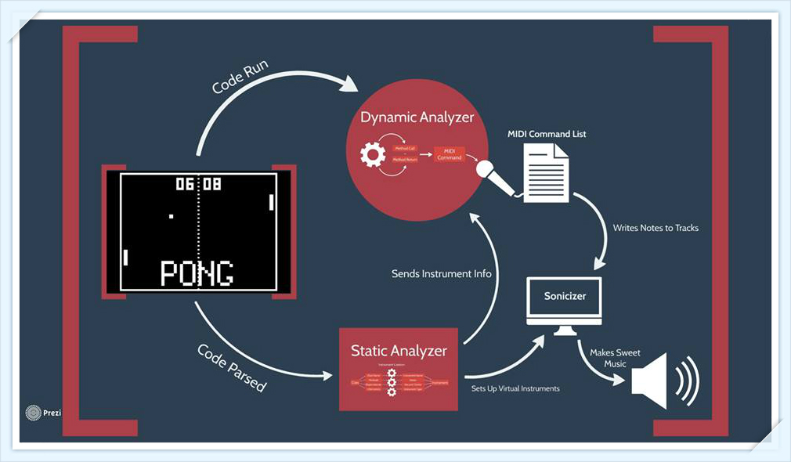

CPSC 410 Term Project
=======
About the Project
===============
>The goal of our project was to produce a soundscape from a running program. Our analysis consists of statically finding classes, methods, fields, dependencies, and inheritance in a codebase. The data from our static analysis is then used to create various instruments, where each class corresponds to an instrument and each function within that class corresponds to a note that the instrument can play. Dynamically, during the running of the program, we monitor method calls and, whenever a method is called, its note plays on its associated instrument. The final output is an audio file that can be played back by the user.

Project Architecture
================


##Running the Framework (Express.js)
To start the server, nevigate to the Tetraminos directory.
```bash
cd Tetraminos
npm start
```
NodeJS now is running at:
```
http://localhost:3000
```

##Running the Static Analyzer
>As the entry point of this project, we need to parse and extract information from the codebases that will be used for further dynamic analysis. [Doxygen](http://www.stack.nl/~dimitri/doxygen/) provides us with clear APIs and configuration in order to accomplish this job. Codebases get converted into a set of XML files that organize each class into a tree structure and encapsulate its corresponding attributes, methods, etc. With ‘xml2js’ module, such a tree structure can be easily converted and manipulated as a JavaScript object. Reading all the input files, classifying them, and extracting the desired information require focus and patience. A unit test is applied to ensure correct output.Finding and defining the dependencies between classes also requires customized algorithm to do so. The entire procedure is highly encapsulated into a fully automated pipe and filter process.


```bash
brew install doxygen (Mac OS X)
apt-get doyxgen (Ubuntu)
```
Copy and paste any C++ source code (__dirname__) into directory: Parser/Source/( 'mkdir Source' if needed)
```bash
cd Parser
node config.js
```
Enter input __dirname__ and a __name__ for the output JSON file.
The static anaylsis result is now saved into directory: Parser/JSON/__name__.json

## Running the Fuser/Dynamic Analyzer

The fuser and dynamic analyzer are compiled together as one binary file. Once the fuser has constructed the necessary objects needed by the dynamic analyzer to identify functions and classes, it starts the dynamic analysis. As a result, compilation of this portion requires all of the dependencies needed for the dynamic analyzer to be installed on the system. These are:

Dyninst: http://www.dyninst.org/downloads/dyninst-8.x

Dyninst requires various environment variables to be set. They are listed in the installation section at the bottom of the Dyninst API, located here: http://www.dyninst.org/sites/default/files/manuals/dyninst/DyninstAPI.pdf

Boost: http://www.boost.org/

Dyninst itself requires Boost, as does the fuser. The fuser requires a compiled version of boost, so the user cannot simply use the Boost headers.

OSCPack: http://www.rossbencina.com/code/oscpack

Needed to construct the instrument profiles, which are used by the Dynamic parser to create midi commands.

Once all the dependencies have been installed, the program can be compiled with the following line, assuming the user is currently in the Tetraminos/static_lib directory.

```g++ -std=c++11 -I [dyninst_include_location] -I [boost_directory] -o run JSONParser.cpp ../../Fuser/DynamicAnalyser/DynamicRunner.cpp ClassProfile.cpp DynamicParser.cpp  DynClassInfo.cpp ../../Sonicizer/OSCMessenger.cpp ../../Sonicizer/InstrumentProfile.cpp [boost_directory/stage/lib/libboost_date_time.a] -L[dyninst_lib_directory] -ldyninstAPI -lcommon -lsymtabAPI -lpatchAPI -lparseAPI -lstackwalk -lpcontrol -linstructionAPI -ldynC_API -ldynDwarf -ldynElf -lsymLite -lsymtabAPI ../../Sonicizer/osc/OscOutboundPacketStream.o ../../Sonicizer/ip/IpEndpointName.o ../../Sonicizer/ip/posix/UdpSocket.o ../../Sonicizer/osc/OscTypes.o ../../Sonicizer/ip/posix/NetworkingUtils.o```

This will result in the creation of the binary 'run'. The project can be started by running:

./run [name_of_binary_to_analyze] [path_to_binary_json]


## Additional notes regarding the Dynamic Analyzer

In the real world, the entire system would be sitting on a web server somewhere, but for development purposes we are just using a local development server.

The Dynamic Analyser is reliant on the user having Dyninst installed on their system. It can be installed here: http://www.dyninst.org/downloads/dyninst-8.x

Dynamic Analyser code exists in Fuser/DynamicAnalyser. Note that test.cpp and main.cpp are unused in the context of the entire project, but are there for testing purposes so that we don't need to compile and load an entire game every time we want to attach to a process and check that dyninst is working as it should.
  - The test.cpp file sets up a program that just continuously calls a function testFunction(), every 2 seconds. The commented out portion of main.cpp sets up the dynamic analyser, attaches to the test.cpp binary file/executable, and printfs to test.cpps consolento every time that testFunction() is called. 
  - To modify this for a larger program, we can just inject the printf into every function and print out the name of the function, as DynamicRunner.cpp does.
  

## Running the Sonicizer
The Sonicizer uses Open Sound Control to communicate with the VST plug-in Omniphere, which is hosted by a scriptable DAW called Reaper. Please refer to: [Omniphere](https://www.spectrasonics.net/products/omnisphere.php), [Reaper](http://www.reaper.fm/), [Setup Tutorial] (www.youtube.com/watch?v=R-dqcGGgDXk)

Before the static analysis process begins, open an empty Reaper project. Run the composer.py script next. The script must be preconfigured to continually look for the MIDI command text document that the Dynamic Analyzer is expected to generate. If the Sonicizer is running on a separate system from the Analyzers, then a shared drive should be used to transmit the command list. To save the audio that is generate for later use, go to File>Render in Reaper and render the master mix to any standard audio format.

Testing Process
================

1. Static Analyzer: Takes a directory of pre-computed xml class files as input; the output expected to be a single JSON object which contains the following format: {staticInfo: [ {className: value, method: [ ], field: [ ], inheritance: value, dependency: [ ]} ...] }
The console prints out error messages for class files not processed by the static parser.

2. Fuser: Takes in a single JSON file computed by the parser as input, assert the file conform s with the class pre-defined structure (Otherwise an exception is thrown). Along with each class profile creation, the consoles prints out it's corresponding string representation.

3. Framework (The wrapper): Triggers the automation process by clicking one of the 
codebase selection buttons. It calls the execution cmd to invoke the game (codebase), following by calling the fuser to fetch the game process id and further invocation on the dynamic analyzer. Again, each invocation prints the assertion statement on the console verifying that the control flow executes correctly according to the plan.

4. Dynamic Analyser: See last paragraph of Dynamic Analyser section for brief description of testing process.

5. Unit Test location: Parser/test/parser-test.js


Codebase
================
Two codebases used in this project: [Pong](https://github.com/chaficnajjar/pong) and [Pokemon](https://github.com/Buntoids/Buntoids).

Ideally our analyzer works on every legitimate C++ code base.

Grand purpose of the project
=======
- _Tracking number of function calls at runtime_: This can be judged by the loudness and saturation of the audio output, the louder it is the more functions being called at the same time.
- _Measuring dependecies between classes_: Codebases with higher coupling will have a more unified sound because classes that are dependant on one another play alike instruments, and play in the same key. The inverse is true for codebases with lower coupling which result in a hectic and cacophonous sound. 
- _Specific function calls can be reconginzed through the corresponding note_

